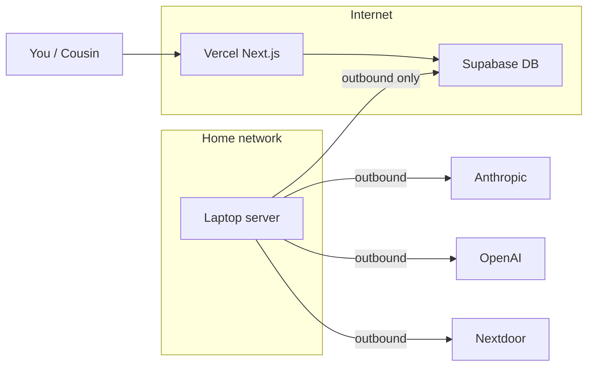

# Deployment: Laptop server, security, and resilience

This document is the single reference for running the Nextdoor Podcast Discovery platform in a near-production way: scraper and worker on an old laptop, optional self-hosting, dev vs prod, backups, alerting, and retry.

---

## 1. Overview

### What this doc covers

- **Architecture and security** — Laptop as server; no inbound ports; network isolation.
- **What runs where** — Vercel (Next.js), Supabase (DB), laptop (scraper + worker).
- **One-command setup** — Script-driven setup for the laptop server.
- **Dev vs prod** — Two Supabase projects, two Vercel envs, env file naming.
- **Self-hosting (optional)** — Postgres + pgvector on laptop/VPS; when it’s worth it.
- **Backup and recovery** — Supabase backups; exports; restore steps; recompute is re-runnable.
- **Alerting and retry** — Healthchecks.io, Slack/email; UI Retry for failed jobs; scraper retry.

### Current vs target architecture

- **Web:** Next.js on Vercel; talks to Supabase; creates `background_jobs` (recompute) from Settings.
- **Scraper:** Scheduled on laptop (or GitHub Actions); writes to Supabase.
- **Worker:** Long-running on laptop; polls Supabase for `recompute_final_scores` jobs; writes `post_scores`.
- **DB:** Supabase (PostgreSQL + pgvector). Local dev uses `docker-compose` (see [README](../README.md)).

The laptop only needs **outbound** internet. It does **not** need to accept inbound connections from the internet.

---

## 2. Laptop as server

### 2.1 What runs on the laptop

| Component | How it runs | Purpose |
|-----------|-------------|---------|
| **Scraper** | Cron or systemd timer (e.g. 1–2× daily for recent and trending) | Scrape Nextdoor, score, recount, embed. |
| **Worker** | systemd service with `Restart=always` | Poll Supabase for `recompute_final_scores` jobs; process one at a time. |
| **Next.js** (optional) | systemd service running `next start` | Only if you self-host instead of Vercel (see below). |

All of these need only **outbound** internet (Supabase, Anthropic, OpenAI, Nextdoor). No port forwarding on your router.

### 2.2 “Securely connect to the Next.js API”

- **Current flow:** User clicks “Save & Recompute” in the UI (Vercel) → API writes a row to `background_jobs` in Supabase. The **worker on the laptop** polls Supabase and picks up the job. The laptop never calls the Next.js API for job execution; it only talks to Supabase.
- **If you add “trigger scrape from UI” later:** Use a tunnel (e.g. Cloudflare Tunnel, Tailscale) so only your app or you can trigger the laptop. Do **not** port-forward 22/80/443 from the router to the laptop.

**Recommendation:** Default is “laptop outbound only.” For UI-triggered scrape, use a private tunnel with a secret path or Tailscale.

### 2.3 Hardening the laptop and network

- **Laptop:** Full-disk encryption (FileVault / LUKs), lock screen, automatic security updates. Use a single-purpose user for the app (no casual browsing).
- **No direct exposure:** Do **not** port-forward 22/80/443 from the router to the laptop.
- **Isolation:** Put the laptop on a **guest network** or secondary VLAN so if it were ever compromised it cannot easily reach your main LAN (other computers, NAS). Many routers support a “guest” SSID.
- **Secrets:** Keep `.env` only on the laptop; never commit. Optionally use a minimal secrets manager (e.g. pass, 1Password CLI) and document the pattern.

### 2.4 Reboot and “always up”

- **No Kubernetes** for this scale. Use **systemd** (Linux) or **launchd** (macOS).
- **Scraper:** systemd **timer** or cron (e.g. `0 2 * * *` and `0 18 * * *` for recent/trending in your timezone).
- **Worker:** systemd **service** with `Restart=always` and `RestartSec=5`. On reboot, the service comes back and resumes polling.
- **Setup script:** Use `scripts/setup-laptop-server.sh` (or equivalent) to create a service user, install env, systemd units, and cron/timers; see [Setup script (outline)](#9-setup-script-outline) below.

---

## 3. What runs where

| Component | Where | Notes |
|-----------|--------|------|
| **Web (Next.js)** | Vercel | Recommended. Alternatively self-host on laptop (see below). |
| **Database** | Supabase | Free tier. Optionally self-host Postgres later (see [Self-hosting (optional)](#5-self-hosting-optional)). |
| **Scraper** | Laptop (or GitHub Actions) | Scheduled 1–2× daily per feed type. |
| **Worker** | Laptop | Always-on; polls Supabase for recompute jobs. |

### Self-host Next.js on the laptop (optional)

Only if you want to avoid Vercel (e.g. data residency). Then:

1. Run `next start` (or build then `node server.js`) on the laptop with `NODE_ENV=production`.
2. Expose it via **Cloudflare Tunnel** or **Tailscale** so you and your cousin can reach it without opening ports.
3. Add a systemd service for the Next.js process.
4. You manage HTTPS (handled by the tunnel) and restarts.

Tradeoff: You own uptime and updates; Vercel handles that for you otherwise.

---

## 4. Dev vs prod

- **Dev:** Dev Supabase project + dev Vercel project (or Vercel Preview env). Use `scraper/.env.dev` and `web/.env.local` (or `.env.development`) pointing at dev Supabase and dev NextAuth URL.
- **Prod:** Prod Supabase project + prod Vercel project. Laptop uses `scraper/.env` (prod Supabase). Vercel uses prod env vars.
- **Vercel:** Two projects (e.g. `nextdoor-dev`, `nextdoor-prod`) or one project with two environments (Preview = dev, Production = prod), each with its own `NEXT_PUBLIC_SUPABASE_URL`, `SUPABASE_SERVICE_KEY`, `NEXTAUTH_URL`, etc.
- **Scraper/worker on laptop:** Point at **prod** Supabase. Dev scraping runs from your main machine with `make dev-scraper` and dev DB.

**Single source of truth:** Dev = dev Supabase + dev Vercel. Prod = prod Supabase + prod Vercel + laptop worker/scraper.

### Prod env vars (laptop, scraper/worker)

| Variable | Purpose |
|----------|---------|
| `SUPABASE_URL` | Supabase project URL (prod). |
| `SUPABASE_SERVICE_KEY` | Supabase service role key (prod). |
| `ANTHROPIC_API_KEY` | Claude scoring. |
| `OPENAI_API_KEY` | Embeddings. |
| `NEXTDOOR_EMAIL` | Nextdoor login. |
| `NEXTDOOR_PASSWORD` | Nextdoor password. |
| `SESSION_ENCRYPTION_KEY` | Fernet key for stored session cookies. |
| `HEALTHCHECK_URL` (optional) | Healthchecks.io ping URL for scrape success/fail. |

---

## 5. Self-hosting (optional)

If you already run the laptop 24/7, self-hosting Postgres is a reasonable future step.

- **Scope:** Run **Postgres + pgvector** on the laptop (or a small VPS). Replace Supabase’s Postgres; run all migrations yourself. Use a connection string and a role with equivalent access to the Supabase service role.
- **Auth:** NextAuth can keep using Google OAuth; you only need a DB for sessions (NextAuth supports Postgres). Self-hosted DB does not require self-hosting Supabase Auth.
- **Lift:** Medium. Run Postgres (Docker or native) with pgvector, run migrations from `database/migrations/`, then point the app at the new URL. You may need to swap `SUPABASE_URL`/keys for `DATABASE_URL` or keep the Supabase client and point it at a Postgres-compatible endpoint. Handle backups yourself (see [Backup and recovery](#6-backup-and-recovery)).
- **When it makes sense:** When you outgrow the free tier, want full control, or want to avoid Supabase dependency. Not required for “robust and cheap.”

---

## 6. Backup and recovery

### 6.1 Supabase (current)

- **Backups:** Supabase free tier has daily backups with short retention. For “I overwrote everything by accident,” (1) enable PITR if you move to a paid plan, or (2) periodically export critical tables (`posts`, `llm_scores`, `weight_configs`, `settings`, `post_scores`, `background_jobs`) via pg_dump or Supabase dashboard backups and store them off the laptop (e.g. S3, Backblaze B2, or another machine).
- **Resilience:** The worker already supports retries (see `database/migrations/009_job_retry.sql`). Jobs can be cancelled. Recompute is re-runnable: create a new job with the same or new weights (or use the **Retry** button in the Jobs UI for failed/cancelled jobs).

### 6.2 Self-hosted Postgres

- **Backups:** Cron job: `pg_dump` (or `pg_dumpall`) daily, compress, upload to off-site storage (S3/B2 or another server).
- **Restore:** Drop the DB (or create a new one), restore from the last good dump, then re-run migrations if needed. Document the exact commands for your setup in this section.

### 6.3 Scraper failure

- **On the laptop:** On failure, call a webhook (e.g. Healthchecks.io “fail”) or send an alert (see [Alerting](#7-alerting)). Use `scripts/run-scrape.sh` which already supports `HEALTHCHECK_URL`.
- **Retry:** Re-run the pipeline: `./scripts/run-scrape.sh recent` or `./scripts/run-scrape.sh trending` manually or via your scheduler. Optional future: “Trigger scrape” from the UI via a tunnel or a “scrape” job type that the laptop runner consumes.

---

## 7. Alerting

- **Who:** You and your cousin (and optionally in-app).
- **Channels:**
  - **Healthchecks.io:** Already supported in `scripts/run-scrape.sh`. Set `HEALTHCHECK_URL` in scraper env; the script pings on success and fails the check on non-zero exit.
  - **Email:** SendGrid, Mailgun, or SMTP relay (many free tiers).
  - **Slack/Discord:** Incoming webhook when scraper fails or a job fails after max retries.
- **What to alert on:** (1) Scraper run failed (exit code non-zero or healthcheck missed). (2) Worker: job failed after max retries (worker can POST to an alert webhook or write to a table that a cron checks). (3) Optional: “Worker hasn’t polled in N minutes” (dead-man’s switch).
- **In-app:** Use the Jobs page to see failed jobs and use the **Retry** button. Optionally add a persistent “Last scraper run: failed at …” on Settings/Jobs with a link to the Jobs page.

---

## 8. Retry and resilience

- **Recompute jobs:** Use the **Retry** button on the Jobs page for jobs in `error` or `cancelled`. This calls `POST /api/admin/jobs/[id]/retry`, which creates a **new** job with the same `params` (e.g. same `weight_config_id`) and type for a clean audit trail. The worker will pick it up.
- **Scraper:** Retry = run `./scripts/run-scrape.sh recent` (or `trending`) again. No job row in the DB for scrape today; optional future: “Trigger scrape” from UI.
- **Worker:** Automatic retries for transient failures are already implemented (see `database/migrations/009_job_retry.sql` and the worker logic).

---

## 9. Setup script (outline)

The script `scripts/setup-laptop-server.sh` (or equivalent) should:

1. **Prerequisites:** Check for Python 3.11+, Node (if self-hosting Next.js), and systemd/cron.
2. **Service user (optional):** Create a dedicated user (e.g. `nextdoor`) for running scraper and worker.
3. **Directories:** Repo or app directory; env file location (e.g. `scraper/.env` from a safe copy).
4. **Env:** Copy or symlink env from a secure location; ensure `scraper/.env` is not world-readable.
5. **Python venv:** Create venv, install scraper deps, run `playwright install chromium`.
6. **Worker systemd service:** Install a unit file that runs `python -m src.worker --job-type recompute_final_scores` with the correct working directory and env; `Restart=always`, `RestartSec=5`.
7. **Scraper schedule:** Install systemd timers or cron entries for recent (e.g. 2:00) and trending (e.g. 18:00) in your timezone.
8. **Enable and start:** `systemctl enable --now nextdoor-worker`, `systemctl enable --now` the scraper timers (or equivalent).

After running the script, you still need to supply the actual `.env` (or secrets) from a safe store. The script should not embed secrets.

---

## 10. Checklist / tasks

Use this list to track deployment and resilience work:

- [ ] Create two Supabase projects (dev, prod) and run migrations on both.
- [ ] Configure two Vercel projects or environments (dev, prod) with correct env vars.
- [ ] Add `POST /api/admin/jobs/[id]/retry` to create a new job with the same params (audit trail).
- [ ] Add **Retry** button in Jobs UI for jobs in `error` and `cancelled`.
- [ ] Document prod env vars for laptop (see [Prod env vars (laptop)](#prod-env-vars-laptop-scraperworker) above).
- [ ] Write and test `scripts/setup-laptop-server.sh` (or equivalent) for your OS.
- [ ] Set up Healthchecks.io (or similar) and set `HEALTHCHECK_URL` in scraper env.
- [ ] Document backup export (e.g. which tables, pg_dump command) and restore steps for your setup.
- [ ] (Optional) Add Slack/Discord webhook for scraper or job failure.
- [ ] (Optional) Self-host Next.js or Postgres using the sections above.
